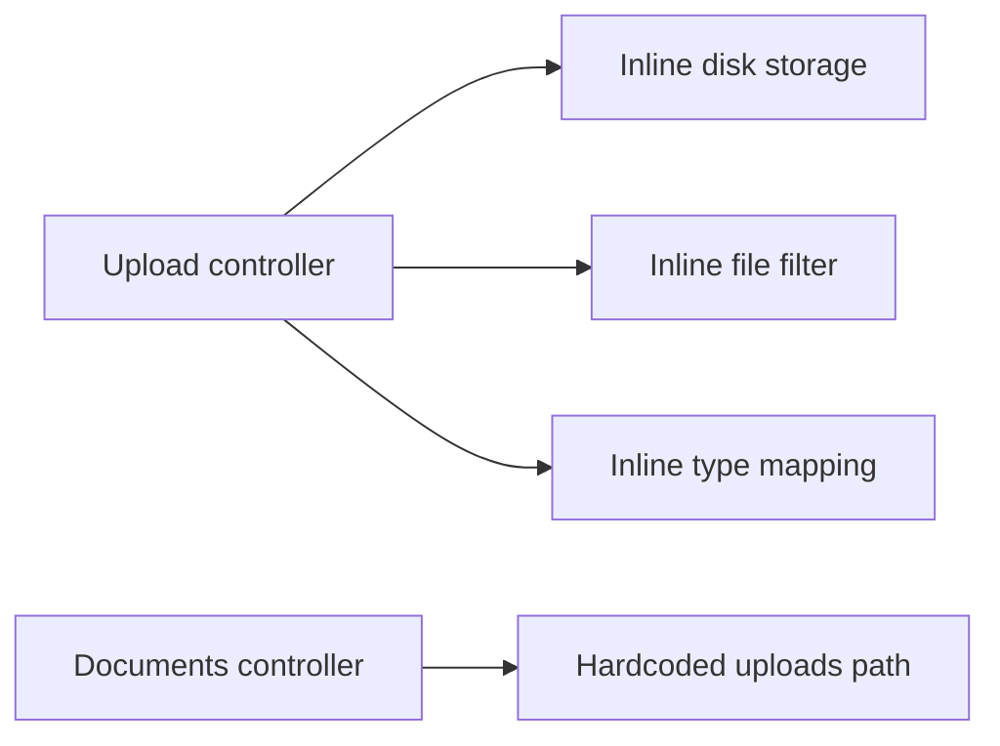
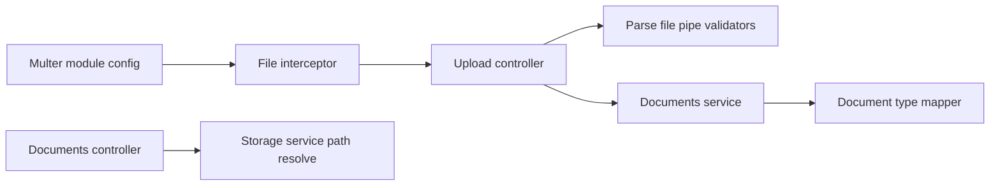

# 1. Problems

The document upload endpoint in the documents module concentrates storage configuration, filename generation, file validation, and document-type mapping inside the controller. The implementation hard-codes the upload path and throws generic errors, resulting in tight coupling and inconsistent API behavior.

## 1.1. **Mixed responsibilities in the controller**
- Location: apps/api/src/documents/upload.controller.ts (lines 21-43, 49-52, 79-88)
- The controller configures Multer storage (`diskStorage`), filename policy, size limits, and file filter directly in the decorator. It also contains the `getDocumentType` business mapping.
- Why it is a problem:
  - Increases coupling between transport layer (controller) and I/O details (filesystem path, naming strategy).
  - Makes changes (e.g., switch to S3, change folder) spread across controllers and duplicated with `documents.controller.ts` which assumes `uploads`.
  - Hides business mapping (document type) inside a web layer class.

Representative code:
```ts
@UseInterceptors(
  FileInterceptor('file', {
    storage: diskStorage({
      destination: './uploads',
      filename: (req: any, file: any, callback: any) => {
        const uniqueSuffix = Date.now() + '-' + Math.round(Math.random() * 1E9);
        const ext = extname(file.originalname);
        callback(null, `${file.fieldname}-${uniqueSuffix}${ext}`);
      }
    }),
    limits: { fileSize: 10 * 1024 * 1024 },
    fileFilter: (req, file, callback) => {
      if (!file.originalname.match(/\.(jpg|jpeg|png|gif|pdf|doc|docx)$/)) {
        return callback(new Error('Only image/pdf/doc files are allowed!'), false);
      }
      callback(null, true);
    },
  }),
)
```

## 1.2. **Hard-coded storage path and duplicated assumptions**
- Locations:
  - apps/api/src/documents/upload.controller.ts: `destination: './uploads'`
  - apps/api/src/documents/documents.controller.ts: `join(process.cwd(), 'uploads', document.filename)`
- Why it is a problem:
  - The base path is duplicated and implicit. Changing the storage location (e.g., to a configurable directory or object storage) requires multiple edits.
  - Prevents environment-based configuration and complicates deployments.

## 1.3. **Inconsistent error handling and weak validation**
- Locations:
  - apps/api/src/documents/upload.controller.ts: `throw new Error('No file uploaded')` and `new Error('Only image/pdf/doc files are allowed!')` in `fileFilter`.
- Why it is a problem:
  - Generic `Error` bypasses Nest's exception pipeline, leading to inconsistent HTTP statuses and response shapes.
  - File validation is embedded in `fileFilter`, which is harder to test and re-use than dedicated validators.

## 1.4. **Loose typing and DTO absence for request body**
- Location: apps/api/src/documents/upload.controller.ts: `@Body() body: any`, `getDocumentType(...): any`.
- Why it is a problem:
  - No class-validator rules for `orgId`, `memberId`, `description` diminishes type safety and input sanitation.
  - The return and mapping functions are not strongly typed against the Prisma `DocumentType` enum, reducing correctness and readability.

# 2. Benefits

The refactor decouples web transport from storage and business mapping, enabling configuration-driven behavior and standardized API errors.

## 2.1. **Reduced coupling and clearer boundaries**
- Storage decisions and document-type mapping move out of the controller into dedicated providers. The controller stays focused on request orchestration.

## 2.2. **Configurable and environment-friendly storage**
- One configuration source of truth for the upload base path; changing directories or switching to another backend (e.g., S3 later) requires edits in a single place.

## 2.3. **Standardized validation and errors**
- Replace ad-hoc `fileFilter` and generic errors with `ParseFilePipe` validators and Nest exceptions. API responses become consistent and testable.

## 2.4. **Improved type safety and testability**
- Introduce `UploadDocumentDto` with class-validator and use `DocumentType` in mapping outputs.
- Expected: Controller code reduces by about **20–30** LOC; cyclomatic complexity of the upload handler drops from about **10–12** to around **4–5** by removing inline options and branching.

# 3. Solutions

Adopt configuration-driven Multer setup, move document-type mapping to a dedicated mapper, introduce DTO validation, and use Nest's `ParseFilePipe` validators for file constraints.

## **3.1. Diagram of Project Module Changes**

Current structure:


Target structure:


The diagrams show that storage and validation move into configuration and validators; type mapping becomes a reusable service; path resolution centralizes in a storage service.

## 3.2. **Centralize Multer config and remove inline options: To solve "Mixed responsibilities in the controller" and "Hard-coded storage path"**

1) Solution overview
- Register Multer at the module level using `MulterModule.registerAsync` to read the upload base path from configuration and define a shared filename policy.

2) Implementation steps
- Add a `UPLOAD_DIR` env config or use a default.
- In `DocumentsModule`, register Multer with `registerAsync` and `diskStorage` based on `ConfigService`.
- Create a `StorageService` to expose `getBasePath()` and `resolveAbsolutePath(filename)`.
- Update controllers to rely on these services.

3) Code before (controller decorator with inline options)
```ts
@UseInterceptors(FileInterceptor('file', {
  storage: diskStorage({ destination: './uploads', filename: /* ... */ }),
  limits: { fileSize: 10 * 1024 * 1024 },
  fileFilter: /* ... */
}))
```

4) Code after (module-level config)
```ts
// documents.module.ts
import { MulterModule } from '@nestjs/platform-express';
import { diskStorage } from 'multer';
import { ConfigModule, ConfigService } from '@nestjs/config';

@Module({
  imports: [
    ConfigModule,
    MulterModule.registerAsync({
      imports: [ConfigModule],
      inject: [ConfigService],
      useFactory: (cfg: ConfigService) => {
        const base = cfg.get<string>('UPLOAD_DIR') ?? 'uploads';
        return {
          storage: diskStorage({
            destination: base,
            filename: (
              req: Request,
              file: Express.Multer.File,
              cb: (error: Error | null, filename: string) => void,
            ) => {
              const unique = Date.now() + '-' + Math.round(Math.random() * 1e9);
              cb(null, `${file.fieldname}-${unique}${extname(file.originalname)}`);
            },
          }),
        };
      },
    }),
  ],
  providers: [StorageService, DocumentTypeMapper, DocumentsService],
  controllers: [UploadController, DocumentsController],
})
export class DocumentsModule {}
```

## 3.3. **Use ParseFilePipe validators and Nest exceptions: To solve "Inconsistent error handling and weak validation"**

1) Solution overview
- Replace `fileFilter` and manual file size checks with `ParseFilePipe` validators. Replace generic errors with `BadRequestException` when no file is present.

2) Implementation steps
- Remove `limits` and `fileFilter` from the interceptor configuration.
- Update the controller method to decorate `@UploadedFile(...)` with a `ParseFilePipe` containing `MaxFileSizeValidator` and `FileTypeValidator`.
- Use `BadRequestException` for missing file fallbacks (usually the pipe catches it first).

3) Code before
```ts
fileFilter: (req, file, callback) => {
  if (!file.originalname.match(/\.(jpg|jpeg|png|gif|pdf|doc|docx)$/)) {
    return callback(new Error('Only image/pdf/doc files are allowed!'), false);
  }
  callback(null, true);
},
...
if (!file) {
  throw new Error('No file uploaded');
}
```

4) Code after
```ts
import {
  ParseFilePipe,
  MaxFileSizeValidator,
  FileTypeValidator,
  BadRequestException,
} from '@nestjs/common';

@Post('upload')
@UseGuards(JwtAuthGuard)
@UseInterceptors(FileInterceptor('file'))
async uploadFile(
  @UploadedFile(
    new ParseFilePipe({
      validators: [
        new MaxFileSizeValidator({ maxSize: 10 * 1024 * 1024 }),
        new FileTypeValidator({ fileType: /(jpg|jpeg|png|gif|pdf|doc|docx)$/ }),
      ],
    }),
  ) file: Express.Multer.File,
  @Body() dto: UploadDocumentDto,
) {
  if (!file) throw new BadRequestException('File is required');
  const type = this.typeMapper.fromMime(file.mimetype);
  return this.documentsService.create({
    filename: file.filename,
    originalName: file.originalname,
    mimeType: file.mimetype,
    size: file.size,
    type,
    description: dto.description ?? file.originalname,
    orgId: dto.orgId ?? null,
    memberId: dto.memberId ?? null,
  });
}
```

## 3.4. **Introduce DTO and type-safe mapping: To solve "Loose typing and DTO absence"**

1) Solution overview
- Add `UploadDocumentDto` with class-validator to validate `orgId`, `memberId`, and `description`. Extract document-type mapping into a `DocumentTypeMapper` service returning the Prisma `DocumentType`.

2) Implementation steps
- Create `upload-document.dto.ts`:
```ts
import { IsOptional, IsUUID, IsString } from 'class-validator';

export class UploadDocumentDto {
  @IsOptional()
  @IsUUID()
  orgId?: string;

  @IsOptional()
  @IsUUID()
  memberId?: string;

  @IsOptional()
  @IsString()
  description?: string;
}
```
- Create `document-type.mapper.ts`:
```ts
import { DocumentType } from '.prisma/client';

export class DocumentTypeMapper {
  fromMime(mime: string): DocumentType {
    if (mime.startsWith('image/')) return DocumentType.photo;
    if (mime === 'application/pdf') return DocumentType.contract;
    if (
      mime === 'application/msword' ||
      mime === 'application/vnd.openxmlformats-officedocument.wordprocessingml.document'
    ) return DocumentType.contract;
    return DocumentType.other;
  }
}
```
- Inject and use `DocumentTypeMapper` in `UploadController`.

## 3.5. **Centralize path resolution for downloads: To solve "Hard-coded storage path and duplicated assumptions"**

1) Solution overview
- Encapsulate base path resolution in `StorageService` and reuse it in `DocumentsController.viewDocument`.

2) Implementation steps
- Implement service:
```ts
import { join } from 'path';
import { Injectable } from '@nestjs/common';
import { ConfigService } from '@nestjs/config';
import { existsSync } from 'fs';

@Injectable()
export class StorageService {
  constructor(private readonly cfg: ConfigService) {}
  getBasePath() {
    return this.cfg.get<string>('UPLOAD_DIR') ?? 'uploads';
  }
  resolveAbsolutePath(filename: string) {
    return join(process.cwd(), this.getBasePath(), filename);
  }
  exists(filename: string) {
    return existsSync(this.resolveAbsolutePath(filename));
  }
}
```
- Use it in `DocumentsController.viewDocument`:
```ts
const filePath = this.storage.resolveAbsolutePath(document.filename);
if (!this.storage.exists(document.filename)) {
  return res.status(HttpStatus.NOT_FOUND).json({ message: 'File not found on disk' });
}
```

# 4. Regression testing scope

This change affects the document upload and viewing flows. Testing should focus on end-to-end behavior from file submission to metadata persistence and file retrieval, with attention to validation and error formats.

## 4.1. Main Scenarios
- Upload image for an organization
  - Preconditions: Valid JWT, `orgId` is a valid UUID, image file within 10MB.
  - Steps: POST /documents/upload with `file` and `orgId`.
  - Expected: 201 response with persisted document, `type = photo`, file saved under configured base path.
- Upload PDF for a member with description
  - Preconditions: Valid JWT, `memberId` UUID, PDF < 10MB.
  - Steps: POST /documents/upload with `file`, `memberId`, `description`.
  - Expected: 201 with `type = contract`, `description` as provided.
- View previously uploaded file
  - Steps: GET /documents/view?id=<docId>.
  - Expected: 200, correct `Content-Type`, inline disposition, streams content from storage service path.

## 4.2. Edge Cases
- Invalid file type
  - Trigger: Upload `.exe` or unsupported extension.
  - Expected: 400 with validator error from `FileTypeValidator`.
- File too large
  - Trigger: >10MB upload.
  - Expected: 400 with validator error from `MaxFileSizeValidator`.
- Missing file
  - Trigger: POST without `file` field.
  - Expected: 400 `BadRequestException` shaped response.
- Invalid UUIDs in body
  - Trigger: `orgId` or `memberId` not UUID.
  - Expected: 400 with class-validator error details.
- Storage base path misconfiguration
  - Trigger: Unwritable directory.
  - Expected: Upload fails gracefully; error propagated via Nest exception pipeline; no partial DB records.
